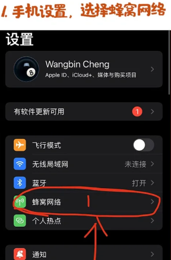
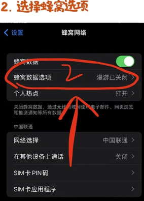
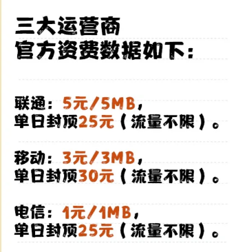
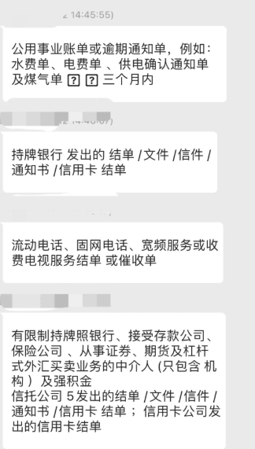
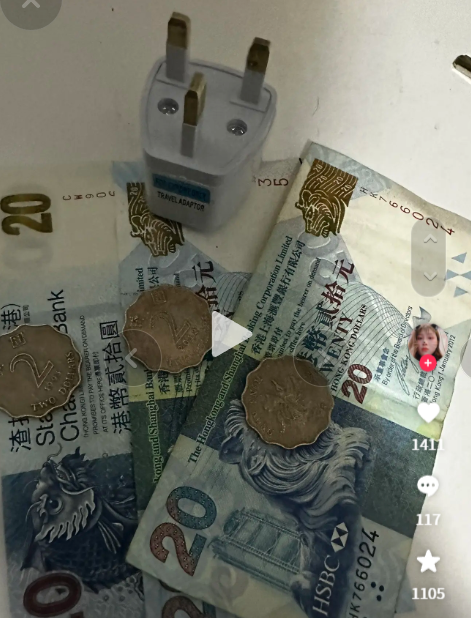
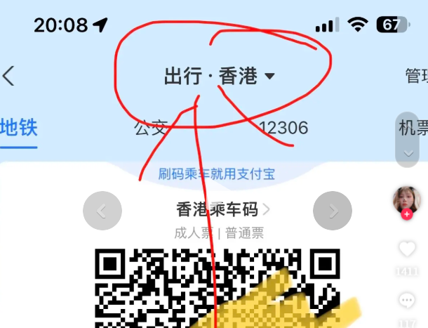

中银香港是国人办卡和持有成本相对较低，且使用也比较方便的银行之一。作为中国银行的子公司，相对来说也更加可靠。
<!--more-->

## 办卡材料

1.  身份证

2.  港澳通行证（有效期 6 个月以上）

3.  过关小纸条（过境海关给的小纸条）

4.  准备一万港币现金（办理成功后预存）

5.  住址证明（可用信用卡带个人地址的账单彩印出来，如果没有可参考使用水电气费缴费单、户口本原件、驾驶证原件、居住证原件等（需个认居住地址精确到门牌号））

6.  A股、基金账户、港美股券商账号（办卡用途可以告知是投资用途）

7.  提前下载好中银 App：中银香港手机银行 和 BoC Pay（下载地址：[https://www.bochk.com/sc/more/ebanking/apps.html](https://www.bochk.com/sc/more/ebanking/apps.html)）

8.  提前开通手机国际漫游（接收短信、流量上网）

手机流量在 支付宝 搜 “境外上网”选香港

## 关于预约排号

中银香港部分的网点需要先网上预约才能去现场取号。比如：土瓜湾道分行，有一些也反馈可以免预约直接现场排队（旺角分行、太子分行、佐敦道分行、奥海城分行等）。实际情况可能随时会变，有时间的最好先预约，多跑几家。

**注意：即使网上预约，到现场也是要排队取号的。**

预约可以通过网页或者微信公众号

微信公众号号可以搜索：**中银香港微服务**，流程如下：

## 注意事项

1.  开户态度要好，保持谦逊

2.  服装得体，说话礼貌尊重

3.  经理问能不能买点理财啥的，如果不想，就婉转拒绝，说有考虑，详细了解后再买

4.  问下卡后会不会进钱，回答会

5.  不要现场提**换汇，数字货币，接收货款**等，就说开户是用于**炒股，储蓄和消费**的，有时候要出国用

6.  开户不得用于非法违规操作

7.  不要把聊天记录和开户信息给经理看

8.  经理没有提到的问题不要去问太多

9.  请提前到现场找好位置不要跑错分行

## 一挪迈总结

香港银行卡是国人做港美股投资的必备条件之一，又条件的建议提前拿下 1 个。我之前写过文章解释为什么：[**建议尽早开办港卡/美股券商**](https://innomad.io/open-hk-bank-account-and-brokerage-accounnt-early)

有了港卡只有，美港股账户的开户相对来说比较容易了。关于券商的选择，可以点击查看我的对比文章：[**美股券商如何选？2024最新对比**](https://innomad.io/choose-us-stock-brokers)

当然，也欢迎加我微信( `innomadstudio` )交流，我也会拉你进交流群，和群友们共同交流讨论各种小技巧。

## 港澳通行证办理方式
- 办理时间  周一至周六 9:00-17:00
- 🔹【办理流程】
1.拍照➡️2.预约取号➡️3.申请表填写信➡️4.缴费➡️5.领证

- 🔸【拍照注意】
会提供深色衣服，所以不用管穿什么，但记得不能带美瞳和首饰🤦‍♀️，浓妆也不🉑️。

- 🔹【需要材料】
无需预约，身份证必带！我自己省外的户口，所以需要居住证，居住证都忘记更新了，特意先去派出所更新的。
- 🔸【办理费用】
2次签注 （15/次）+拍照 （60）
一共90元💰（好便宜～）
-🔹【领取方式】
↘️省内：7个工作日
↘️省外：20个自然日
可以用zfb或者gzh通过编号查询进度
带好本人身份证和回执单在机器上1分钟搞定
- 未到期的签注只要机器上刷一下付下费就行 

签注和时间
🔥一年一次(💰15）
🔸有效期为一年，不是一年只能去一次
🔸每次逗留不超过7天
🔸去完后可以马上随时续签，续签后可以随时出发
🔥一年两次(签注费💰30）
🔸有效期为一年，这两次签注在一年内有效
🔸每次逗留不超过7天
🔸第一次去完回来后当天或第二天可以马上又出发
🔥三个月一次(💰15）
🔸有效期为3个月
🔸每次逗留不超过7天
🔸当通行证有效期少于一年时，换新证前只能签三个月的
🔥一年多次(💰80）
🔸有效期为一年，可以多次往返(仅限深户)

## 开通手机国际漫游

资费

## 中银和汇丰香港

✅2024-12-16 已验证
 中国银行（香港）(太子分行)
 汇丰银行（香港）(始创中心)
🚌交通
荃湾线→ 太子→ B1出口→出口就是中银，步行10分钟左右能到汇丰创始中心网点。
✅2024-12-14 已验证
中国银行（香港）(元朗青山道分行)
汇丰银行（香港）(元朗分行)
🚌交通
从福田口岸出来转B1巴士直达，汇丰大厦2楼，步行5分钟左右到中银。
	
✅2024-05 已验证
 中国银行（香港）(下葵涌分行)（高德搜不到，在Google Map叫下葵涌分行）
 汇丰银行（香港）(葵芳分行)
荃湾线→葵芳→ D出口，过马路，对面新都会mall的背面就是汇丰葵芳分行，步行5分钟左右到中银。
	
尖沙咀：公众号“深港跨境通”可购买大巴单程票，深圳湾-尖沙咀7.30那班（1h），有好吃的，可以玩玩

⭕️⭕️⭕️平均办理时间
⏰中银香港：60分钟
⏰汇丰香港：30分钟

## 注册蚂蚁银行
用手机号注册

## 众安银行

汇丰和中银，汇丰只要了身份证和通行证10分钟就就下卡了，中银要了我身份证通行证和过关小票30分钟拿到卡，这两🏠我都是有提前预约的

## 插座

## 汇率查询 

支付宝 搜“汇率查询”

## 出行
选 地铁

