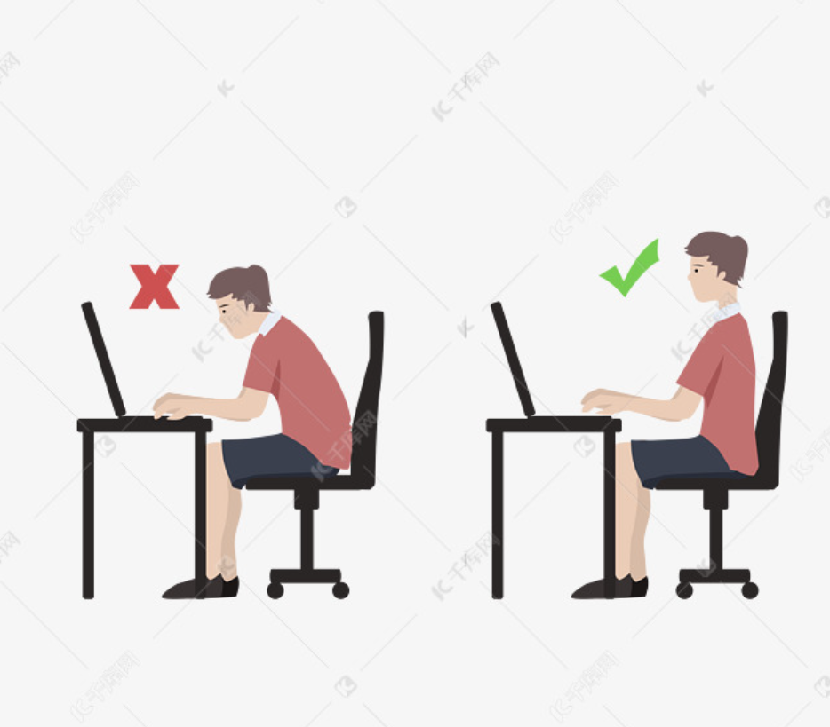

保持健康的一些行为

## 休息

## 赫曼米勒
Aeron 没有头枕，因为他们官方认为，如果你需要头靠在头枕上了，那是你需要休息了

## 久坐

腰背部：瑜伽婴儿式加猫氏伸展，做三次，做完瑜伽婴儿式紧跟猫氏伸展，帮助我恢复腰部肌肉灵活性。
上背部：瑜伽婴儿式变种，保持脚后跟和屁股接触，左侧或者右侧偏移30多度，拉伸背部肌肉。
青蛙趴：拉伸髋部，久坐会导致髋部紧张，做两次。
泡沫轴滚动大腿肌肉：会发现肌肉筋膜是一个整体，腰背部高敏感的人，往往大腿肌肉也很紧张，分为 正面滚动，侧面滚动，左右腿各两次。
腹部拉伸：就是趴着地上，用手臂将上半身支撑起来，拉伸腹部。拉伸三次
大腿内侧拉伸：平躺，用弹力带钩住脚背，手部发力，将大腿拉起成 90度垂直地面，感受内侧肌肉拉伸，左右腿各一次。
最后拉伸臀部肌肉：平躺，小腿弯曲和大腿垂直，放于另一条腿的膝盖处，用手钩住膝盖后面，拉起到胸部的位置。各一次。
一套下来 差不多20分钟，做完身上就很放松，慢慢感觉肌肉都有弹性了。b站就有很多拉伸视频，坚持的话效果就很好！治本之道！

## 正确的坐姿

坐直身体，用坐骨发力

## 健康饮食
| 升糖低的食品 |                           全麦食物、蛋白质、草莓/梨/苹果、坚果每天至少喝1.8升水                           |
| :----------- | :------------------------------------------------------------------------------------------------------- |
| 早餐(7:30)   |              蛋白质:豆浆、鸡蛋全麦食物:全麦麦片、全麦面包、全麦饼干水果:香蕉/草莓/蓝莓/苹果               |
| 10:30左右    |                                         坚果(什锦或瓜子仁)或水果                                          |
| 午餐(12:30)  | 荤菜:鱼肉  素菜:豆芽、生菜、海带、韭菜、生菜、西蓝花、绿豆、豆腐(干)、扁豆、四季豆  主食:少量米饭 |
| 15:00左右    |                                           坚果或水果(黄瓜/番茄)                                           |
| 晚餐(18:30)  |               蛋白质:原味酸奶  全麦食物:全麦麦片、全麦面包、全麦饼干 水果:黄瓜/番茄               |
| 21:30左右    |                                    水果(黄瓜/番茄)+坚果(什锦或瓜子仁)                                     |