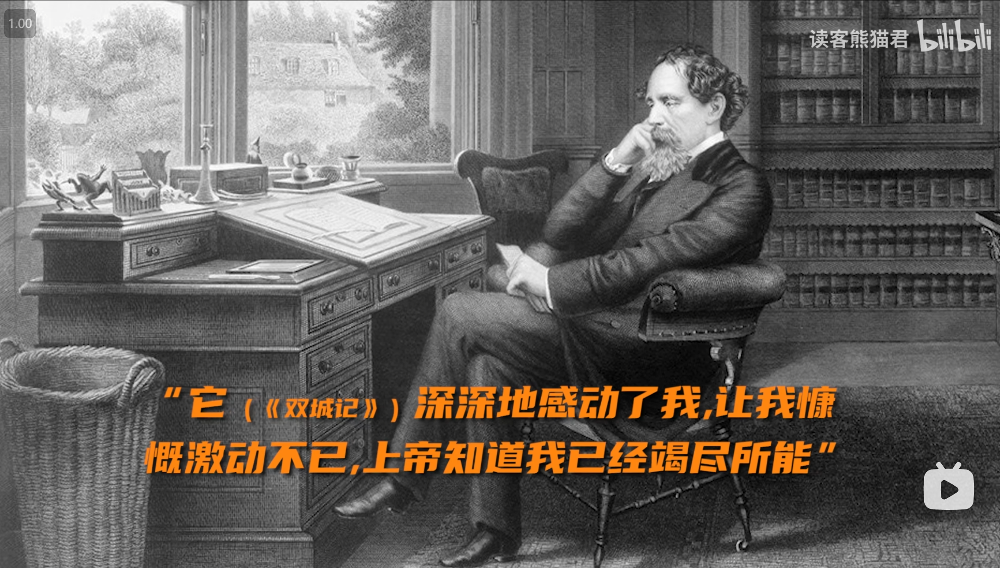

《双城记》（英语：A Tale of Two Cities）是英国作家查尔斯·狄更斯著作的一部以法国大革命为背景所写成的长篇历史小说，情节感人肺腑，是世界文学经典名著之一，故事中将巴黎、伦敦两个大城市连结起来，围绕着医生一家和平民出身的革命党夫妇为首的圣安东尼区中展开一场揭开位于法国的贵族所隐藏的黑暗面，以及揭发双方之间在十八年前隐瞒世人与不为人知的幕后故事。故事里面描述描写当时的法国王室的终结、法国贵族是怎样做出残害百姓、抢占民女、草菅人命等行为引起众多人民的愤怒、憎恨与不满，促使革命党雅各宾派扇动人民对腐败王室展开法国大革命的故事。

<!--more-->

## 故事纲要
故事的舞台在巴黎、伦敦两大城市之间，围绕着法国医生一家和以平民出身的革命党夫妇为首的圣安东尼区中展开一场揭开法国贵族的黑暗面以及两者之间在十八年前在背后隐瞒世人、不为人知的幕后故事。里面描述当时的法国王室的终结、法国贵族是怎样做出残害百姓、行抢民女与草菅人命等行为引起众多人民的愤怒、憎恨与不满，促使革命党雅各宾派扇动人民对腐败王室展开大革命的故事。

### 开场白
那是最好的时代也是最坏的时代，那是充满智慧的时代也是最愚蠢的时代，那是信仰的时代也是怀疑的时代，那是光明的季节或是黑暗的季节，那是希望的春天也是绝望的冬天，我们面前即使有一切或者面对一无所有，我们都迈向天堂都直奔另一条路——在简而言之，那个时期与现在的时期相去甚远，以至于它的一些最喧闹的权威坚持认为它被接受，无论好坏只在最高的比较之中。

### 一位“政治犯”复活的讯息
1775年11月，一位年迈的男子在搭乘从伦敦前往滨海都市杜佛的深夜马车。这名男子是伦敦的泰尔森银行经理贾维斯·劳雷（Jarvis Lorry），他的年纪虽然大却仍然不顾年迈身躯搭乘马车的目的是为了他十八年前在过去无法忘记的往事。 十八年前的也就是1757年的12月，劳雷在泰尔森银行驻巴黎的工作期间由于生意的来往因此结识不少法国人民，在这些法国人民当中，法国的医师亚历山大·曼奈特（Dr. Alexandre Manette）与他的英籍妻子跟劳雷互为好友关系，他们将财务交给劳雷与银行所保管。但是曼奈特却不知道为什么在他妻子将要临盆前就突然与世隔绝、杳无音讯。当时所有人都急忙找寻曼奈特医师的行踪却都毫无结果，曼奈特医师的妻子为此感到很悲痛之下育有女儿露西·曼奈特（Lucie Manette）在抚养她两年后以忧郁而终，因此劳雷带着悲痛的心情将露西带去伦敦交托给善良的女佣波希小姐（Miss Pross）来抚养她成人。

十八年后，劳雷刚收到银行的搬运工杰里·克伦彻（Jerry Cruncher）所传达的消息，根据杰里的情报指出曼奈特在十八年前还活着，当时他因为不明原因被当成政治犯而关进巴士底狱的北塔105号牢房，最近曼奈特医生被释放后没多久因为身心长期受到严重摧残变得失忆处于精神失常的状态，所以他就由他的前佣人兼圣安东尼区的酒店(革命活动的联络站)老板欧内斯特·德法奇（Ernest Defarge）与他的年纪妻子泰雷莎·德法奇夫人（Madame Defarge/Teresa Defarge）所提供阁楼住处内安顿下来，不过他每天总是用制鞋工具来制做鞋子来度日(当时他待在巴士底狱的期间就是靠这些技巧才能存活的)。

劳雷在拜访露西与波希小姐时将曼奈特医师还活着的消息告诉她们，起初露西在听闻她早已去世的父亲还活着的后决定跟随劳雷去法国，后来劳雷跟露西到巴黎的圣安东尼区然后在德法奇的带领下找到曼奈特医师，刚开始曼奈特医师有点精神错乱完全不认得德法奇与劳雷两人，后来他发现露西的金发与他亡妻的发色即为相似，他知晓露西的身份后就拥抱她，后来露西和劳雷在德法奇与正在编织围巾的泰雷莎·德法奇夫人的目送下带着曼奈特医师离开酒店，他们在傍晚时分离开巴黎返回伦敦。

### 两位身份不同的青年、革命的开始
五年后，曼奈特医师在露西的照料下逐渐康复，两人住在伦敦的幽静的宅邸里，由于曼奈特医师在十八年前还活着的消息迅速传播在外界，有不少的病人也纷纷找曼奈特医师过来治病，因此曼奈特医师父女的生活变的富裕起来不少。某天，伦敦的法庭正在处理一桩间谍案件，使曼奈特医师与露西和劳雷都坐在旁听席上，被告者是一位英俊的青年查尔斯·丹尼（Charles Darnay），他因为涉嫌在英法之间从事不可告人的秘密行动被以涉嫌为间谍的嫌疑遭到起诉。 被传唤至法庭兼告发查尔斯的人是约翰·拔沙（John Barsad），他解释他在五年前目睹查尔斯搭成马车到伦敦却在途中下车收集些秘密情报，查尔斯解释他仍然在法国不可能搭上往伦敦至杜佛的马车，而被法官给传讯的劳雷也否认他在车上没有看到查尔斯，但是在约翰的指证与查尔斯的辩解下案子的结果依然毫无结果，这时一个有才华但愤世嫉俗、同时担任查尔斯的辩护律师的助手雪尼·卡顿（Sydney Carton）突然在变条上写着什么字条然后将纸条扭成小团状扔给律师，律师看到纸条然后看清楚查尔斯的容貌时，突然质问约翰是否看错对方的长相，听众发现卡顿与查尔斯的样貌及为相似开始宣闹起来令约翰不得不说他看错对方。这使法官只好宣判查尔斯以无罪释放。

后来露西在法庭将查尔斯介绍给曼奈特医师，但是曼奈特医师看到查尔斯时露出不太高兴的模样使露西为此很担心，因此她只好缠扶曼奈特医师回去，令一方面，卡顿看着律师向众人炫耀法庭上的审判经过，他从以前很早习惯没有人关注与爱护自己的行为，不过这也使他露出变得懒散、消沉与寡欢的模样。之后查尔斯与卡顿经常造访曼奈特医师并且对露西产生爱慕之情，后来，查尔斯曾跟曼奈特医师父女叙述他听过伦敦塔内部的传闻出人们在有一次挖掘伦敦塔时在某个地牢中发现墙角一块石墙上看到某个囚犯刻着“挖掘”二字的字迹，那个石墙被挖开后里面只有一团纸灰团，据于里面写什么内容到现今仍是个谜团，这时曼奈特医师还没听完查尔斯讲述的故事时突然激动起来，但是他看到露西产生介意时恢复常态并且解释他看到一大滴雨水滴落在自己的头上时感到惊慌，不过劳雷却早已猜测曼奈特医师的诡异举动，因为他将查尔斯误看成在十八年前令他被关押在巴士底狱的恶人也就是查尔斯早已断绝往来的叔父——厄弗里蒙地侯爵（Marquis St. Evrémonde），当年厄弗里蒙地侯爵跟他的孪生兄弟(查尔斯已故的父亲)诬陷曼奈特医师将他给关在监狱，甚至在十八年后依然做些许多为非做歹、沈迷色欲以及涂炭生灵的行径，因此查尔斯对他的家族的行为产生厌恶与不满并且继承他过世的母亲所交代的遗言下独自走到伦敦去谋生。与此同时，查尔斯的叔父厄弗里蒙地侯爵仍然在他的豪华乡间宅第内跟其他多数的贵族们过着纸醉金迷与骄奢淫逸的奢侈生活中，他每天早上都要有四位佣人来服侍自己，厄弗里蒙地侯爵很希望他的侄子查尔斯能继承他们家族的遗产，他最近写信给查尔斯回来是要处理他们家族遗产的手续问题，但实际上他是要支配与控制查尔斯当做借口，自从他在贿络约翰的计划失败后就依然无法谅解查尔斯的转变为平民的想法，所以厄弗里蒙地侯爵将查尔斯视为他们家族中最大逆不道的败家侄子。某天早上，厄弗里蒙地侯爵命令他的马伕驾驶马车若无其事地在拥挤的街道上肆无忌惮地狂奔行驶，结果他的马车辗毙一位农夫加斯帕德(Gaspard)的孩子，虽然他支付赔偿金给加斯帕德却无法平息他的悲怒，这时劝阻加斯帕德的德法奇趁着厄弗里蒙地侯爵离开前将金币用力丢回马车上，促使厄弗里蒙地侯爵为此大怒辱骂观看现场的人群。

厄弗里蒙地侯爵与刚来到宅邸的查尔斯碰面后开始争论不断，厄弗里蒙地侯爵埋怨最近革命的变动促使法国王室的势力衰退还有法国贵族的制度受到限制，现在他们无法再过着些繁华富贵的生活，查尔斯表明他早已对叔父总是迷恋他们身为贵族的生活方式与所做的行径感到很厌恶，他打算要开始为他们家族所做的行为做些真心的忏悔或得上帝的宽恕与原谅，厄弗里蒙地侯爵为此感到震怒与批评查尔斯决定要抛弃他们的家族借此舍弃继承遗产的事，最终查尔斯只好以不欢而散的方式直接离开法国并且劝告他的叔父应该要以人民的处境着想为先而不是迷恋贵族的生活，但是厄弗里蒙地侯爵并没有把查尔斯的忠告给听进去，他依然在思考着要用什么样的手段让查尔斯身陷不利的情况。结果，厄弗里蒙地侯爵在当天晚上被人发现自己在自己卧室已经气绝身亡，而犯案的凶手用小柄首在刺杀厄弗里蒙地侯爵后留下一张写着“送他进入地狱的坟墓 雅各宾派留”的浅草字迹便条。之后厄弗里蒙地侯爵遭人刺杀身亡的消息在隔天早上迅速传遍置法国内，让多数专制政权的贵族们感到很慌恐到派遣大量的军警追缉与严惩凶手。几天后，雅各宾派的人们聚集德法奇的酒店开始策划革命行动，泰雷莎在她编织围巾上编织成不同的花纹，她的围巾记录着当年的贵族们是如何残忍对待百姓的经过，泰雷莎非常想要找到绝佳的机会向贵族们展开复仇计划，她甚至在夜幕向群众的面前鼓舞他们参与革命行动，德法奇跟雅各宾派的少数民众在酒店内聊到有关巴士底狱北塔105号的讯息情报以及他们在外出听闻刚刺杀厄弗里蒙地侯爵后逃亡、被逮捕的加斯帕德在某座乡村被判处于绞刑的消息，他们决定是时候要让贵族们好好体验一下当年百姓是如何遭受残酷对待的感受。

### 法国大革命的风暴、重返巴黎
后来，返回伦敦的查尔斯要求效忠他多年的管家泰奥菲尔·盖白勒(Théophile Gabelle)将他家族的遗产全数分法给平民，然后他担任一位法语教师引起学生们的尊敬与露西的仰慕，曼奈特医生虽然很介意查尔斯的身份背景，但是他为了考虑露西的将来的理由不得不同意答应婚事。之后曼奈特医生在露西跟查尔斯结婚到外地蜜月之旅的两个礼拜期间独自在小屋中开始使用制鞋工具引起劳雷的注意，劳雷要求曼奈特医生为了不让露西感到担忧的缘故劝他停止这种令人不解的动作，曼奈特医生明白劳雷的意思与苦衷后就保证自己已经不会再次做这种事，劳雷答应曼奈特医生将他的制鞋工具给摧毁掉，后来露西回来后见到她父亲已经复原快速相当地很欣慰。几天后，卡顿到曼奈特医生家的宅第上前祝贺露西，他解释虽然自己无法为露西带来幸福，不过他只要能守护她就足够，露西在卡顿回去得当天晚上向查尔斯解释他们是否可以对卡顿好些，几个月后卡顿在露西的关心下经常拜访曼奈特医生，他在那个时候成为露西的女儿所喜欢的对象。

1789年的7月中旬的晚上，劳雷带着疲惫的心情造访曼奈特医生一家，他告诉曼奈特医生近年来巴黎的动乱持续不断让不少的法国贵族开始逃亡海外的消息，与此同时在巴黎，平民们开始纷纷带着武器、枪械等物品开始聚集在广场，而以德法奇夫妇为首的雅各宾派党召集些圣安东尼区的贫民窟居民往巴士底狱的方向开始行动，很快地，烟火迅速笼罩着巴士底狱的高塔与城内直到军对投降为止使德法奇夫妇带领平民们冲破监狱开始展开“行动”，德法奇在混乱间挟持一位狱史得到北塔105号是无见天日的牢房的答案后，他到105号牢房查看后搜索番后找到曼奈特医生待在此牢房内写上的字迹的纸条，而泰雷莎高声指挥民众将典狱长给挟持至庭院内，她观看民众们将典狱长给殴打到断气后当场将他的首级给砍下来，然后命令一位平民将典狱长的首级挂在高塔顶上，之后平民们纷纷在城市至乡间内烧毁多数贵族的宅第(包含查尔斯的叔父厄弗里蒙地侯爵的乡间住所)，然后将不少前财政大臣与贵族们不是在街上做些侮辱般的游行、当场处刑和吊挂在街道上的路灯就是送他们全数到断头台上。只有少数幸免于难的贵族们纷纷逃亡到国外甚至逃难到英国聚集在泰尔森银行内想要确保他们的财富是否安然无恙。

劳雷在这些法国贵族们中试图打听法国内的情况与消息全部告诉曼奈特医生，他不顾曼奈特医生的劝阻决定要到巴黎尽快抢救留在巴黎银行的文件资料，这时劳雷收到一封要给查尔斯的信件，查尔斯接到信件后发现这事他的管家盖白勒写的求救信，盖白勒在信上写着他虽然将查尔斯的叔父厄弗里蒙地侯爵家族的遗产全数分给平民却仍被捕入监的经过，查尔斯知道盖白勒是因为自己的理由遭遇灾祸，他决定去巴黎营救盖白勒然后跟曼奈特医生与露西不告而别独自到法国，但是他很快的遭到革命法庭的武装人员给抓获并以逃亡罪给关入拉逢斯监狱。曼奈特医生与露西知道发现查尔斯留下他要到巴黎的讯息后迅速跟劳雷会面，曼奈特医生要求劳雷确保露西的安全，而自己则是四处奔走打听查尔斯的行踪，由于曼奈特医生在巴士底狱被监禁的经历博得法国人民的同情，所以他很快地打听到查尔斯被关入拉逢斯监狱的消息，劳雷对查尔斯的处境感到很担忧，而曼奈特医生任为如果他将他十八年前的经历全部说给全巴黎的爱国者，到时查尔斯与他的管家盖白勒将会被释放出来，露西在她父亲曼奈特医生出门至隔中午后开始对丈夫的处境感到很担心，这时德法奇夫妇出现将曼奈特医生写着查尔斯安然无恙，自己暂时无法回去的字条交给劳雷，知道查尔斯毫发无伤的露西暂时放下担忧，她直接哀求泰雷莎不要对查尔斯有什么不利的举动，但是泰雷莎跟露西解释他们被贵族给迫害期间从来没有获得关住也没有人出手帮助他们的痛苦经历，她带着德法奇离开前要求露西不能只想着查尔斯的处境。

另一方面，曼奈特医生在四天后回去并且将消息说给劳雷听，曼奈特医生解释在他到拉逢斯监狱的期间发现由雅各宾党组成的革命法庭内聚集不少的“政治犯”，这些草率的判决中有一千一百多个人都被送入断头台，他跟法庭以自己曾是巴士底狱的囚犯与德法奇的证明下希望能藉以释放查尔斯却被拒绝回应，但革命法庭的法官说他们会确保不会将查尔斯给处刑的承诺，而曼奈特医生决定看守查尔斯直至危险过去后才能离开，曼奈特医生离开监狱后靠着自己的经历成为三个监狱的医务观察员去探访查尔斯，然后将查尔斯的消息全部告诉露西。但是随着时间过去，情况变得严峻起来，由于雅各宾党的执政期间，他们不只将企图逃亡而失败的国王路易十六与王后玛丽·安东妮夫妇送上断头台，甚至将不少的“政治犯”与落为阶下囚的贵族们送往以“格洛提姑娘”的断头台上作为血祭，曼奈特医生却依然相信他一定会尽快挽救查尔斯。后来，一年零三个月过去之后，露西依然一直照料父亲与女儿，每当她对查尔斯的事感到很担心时获得她父亲的安慰，后来等到审判的时刻，露西、曼奈特医生与劳雷提早到革命法庭，而查尔斯带至法庭向国民公会解释他早在革命还没发生前早已抛弃贵族身份离开法国，自己没有涉嫌逃亡的意思，而曼奈特医生激动地跟国民公会的人解释查尔斯是因为要拯救他的管家盖白勒来到法国，曼奈特医生为查尔斯的声明引起民众们的同意，他们一至要求法庭的人释放查尔斯，后来查尔斯在他的管家盖白勒被释放后终于能返回露西与曼奈特医生的身旁，后来查尔斯与露西带着曼奈特医生走出革命法庭。

### 逆转局势的纸条内容、为了守护爱人的牺牲举动
事情落幕后，曼奈特医生与查尔斯与露西原本暂时放松些，但是革命法庭的人员上前解释情况改变的理由又再度带走查尔斯，原因是检举查尔斯的举发者居然是德法奇夫妇与曼奈特医生，隔天早上，查尔斯被送入革命法庭令曼奈特医生感到很震措然后解释他没有做出检据他的女婿的行为，但是革命法庭的武装人员拿着曼奈特医生在十八年前留下来的纸条当场说给听众聆听。原来，曼奈特医生在十八年前写下的纸条内容讲明他在十八年前受查尔斯的叔父厄弗里蒙地侯爵与他孪生兄弟的委托下到他们的宅第里面帮忙看诊，虽然曼奈特医生不知道事情的详细经过，但是他在别墅的阁楼与放至干柴的木屋内分别看到一个病色苍白、陷入发狂而亡的年轻妇女与一位身重剑伤、面临濒死的青年气绝的情况，当时那位伤势严重的青年在临终前跟曼奈特医生解释他与他姐姐都是厄弗里蒙地侯爵侯爵家的佃户，他在对厄弗里蒙地侯爵兄弟与他们的亲人施下严厉神裁的诅咒期间描述他们所遭遇的经历、自己将他们的妹妹给藏匿起来远离祸害的经过以及厄弗里蒙地侯爵兄弟所犯下的杀人、行抢民女、享受色欲等罪行，因此曼奈特医生打算写信给宫廷的王室公开这件事，他在写信前为了不牵连自己的妻子决定瞒着她。 后来隔天，厄弗里蒙地侯爵的弟媳德奥奈夫人(查尔斯的母亲)拜访曼奈特医生，她解释自己完全无法原谅她的丈夫与小叔的罪行，但她为了考量到她儿子的将来所以决定将自己所有珠宝送给他们家族的佃户家中仅剩的年轻女农也就是那对农家姐弟的妹妹来弥补自己的自责与罪恶感，即始无法向那位少女请求原谅与宽恕至少也要获得上帝的原谅与宽恕，虽然曼奈特医生明白那位贵妇的善良与好意决定不法举发她，可是他遭受厄弗里蒙地侯爵兄弟的陷害下被关入巴士底狱，因此曼奈特医生决定就算自己处于不力的情况也要把自己所亲眼目度的经历全都记录下来，直到有人将这件事给揭发出来为止，结果查尔斯因为曼奈特医生在十八年前留下的纸条内容被判处在二十四小时内送入广场的断头台之刑，让露西听到判决结果时悲痛到晕过去。

这时刚赶到法国的卡顿赶紧扶起露西带着她与曼奈特医生送回寓所，原来他听闻查尔斯有难的消息来到法国。卡顿安慰曼奈特医生一家后就独自走入巴黎的街道中走入德法奇开设的酒店中，他在无意间听到德法奇夫妇与少数民众的对话，德法奇跟泰雷莎说查尔斯将会背负他家族的罪行付出代价的事，但是他希望泰雷莎不要把曼奈特医生一家也视为仇恨的对象，但是泰雷莎反驳德法奇的要求，她说明自己正是曼奈特医生提及的厄弗里蒙地侯爵的弟媳德奥奈夫人生前正在寻找的农家少女，泰雷莎解释厄弗里蒙地侯爵生前与他的孪生兄弟是怎么将她的兄姊与亲友给迫害致死还有自己虽然生还却得面临丧亲之痛的经过，她立誓不将自己最痛恨的厄弗里蒙地侯爵一族给灭绝是不轻言善罢甘休，泰雷莎的话令法德奇不知道该怎么办才好，卡顿听见整件事的经过迅速离开酒店然后跟劳雷要求他明早带着曼奈特医生一家迅速离开法国然后将自己的证件交给劳雷，而且吩咐劳雷替自己保留座位然后说是这个座位有人要立刻动身。即使他们打算在下午在马车内等他回来时就要离开。后来，卡顿到拉逢斯监狱与约翰碰面并且贿赂他得以进入监狱，这时在监狱的查尔斯正写着给曼奈特医生与露西的遗书时与卡顿碰面，查尔斯要求卡顿不希望因自己的缘故受到牵累并且要求他离开监狱，但是卡顿用麻药将查尔斯给弄昏后将他交给约翰，而自己则在牢房等待着他早已注定的命运。另一方面，曼奈特医生与露西在劳雷的安排下早已准备就绪搭上马车，他们在毫不知情的情况下将查尔斯看错成卡顿带着他离开巴黎回到伦敦，查尔斯在离开巴黎后醒来跟着曼奈特父女重聚。

与此同时，泰雷莎到曼奈特医生的寓所正要开始找他们时却发现房内凌乱不堪、空无一人的迹象，恰巧曼奈特医生家的女佣波希小姐正等她的兄长约翰过来与曼奈特医生一家会和，当她发现泰雷莎手持着短刀与枪械时开始二话不说的唇枪舌剑、扭打起来，结果在打斗中波希小姐无意间触碰泰雷莎的手枪扳机，导致泰雷莎的随着火光一响而中枪倒地身亡。波希小姐跟她的兄长约翰会面后迅速离开巴黎。另一方面，押送当天要装满五十二个“祭品”的囚车沿着巴黎的街道到广场，当时假冒查尔斯的卡顿安慰一名背负莫须有罪名的女裁缝并且叙说他们会得到仁慈的庇护，之后卡顿牺牲他自己换取查尔斯的生命走入断头台，后来露西在知晓卡顿的牺牲换取查尔斯的生命的消息时感到很哀伤，她和查尔斯育有名叫卡顿的儿子做为纪念卡顿与曼奈特医生过着平静的生活。

### 结尾
狄更斯在考虑即将迈上断头台的卡顿最后预言性愿景作为故事结尾： 我看到多数的民众、巴尔萨德、克莱、德法奇、一个跟随德法奇夫人的雅各宾派党的成员、陪审员、法官，一长串新的压迫者，他们在旧压迫者的毁灭中崛起，在这种报复性的工具面前灭亡停止其目前的使用。我看到一座美丽的城市和一群聪明的人民从这个深渊中升起，在他们为真正自由而奋斗的过程中，在他们的胜利和失败中，在未来的漫长岁月中，我看到了这个时代和以前的邪恶这是自然的诞生，逐渐为自己赎罪和磨损。

我看到我为之献出生命的那些生活，在我再也见不到的英国，和平、有用、繁荣和幸福。我看见她(指的是露西)怀里抱着一个孩子，孩子就是我的名字。我看到她年事已高的父亲(指的是曼奈特医生)在他的医治办公室中对所有人忠实并且很平静。我看到好心的老人劳雷(他们的老友)在十年的时间里用他所有的东西照料着他们，然后平静地接受他的奖赏。 我看到我在他们的心中拥有个避难所，在他们的子孙后代的心中。我看到一个老妇女在这一天的周年纪念日为我哀掉。我看到她和她的丈夫并排躺在他们最后一张尘世的床上，我知道在彼此的灵魂中，每个人并不比我在他们的灵魂中更受尊重和神圣。

我看到那个躺在她怀里并以我的名字命名的孩子，一个男人在曾经属于我的人生道路上奋力前行。我看到他赢得如此出色，以至于我的名字在他的光芒下变得赫赫有名。我看到我涂在上面的污渍消失了。我看到他，最公正的法官和尊贵的人，带着一个我的名字的男孩，有着我认识的额头和金色的头发，来到这个地方——那时看起来很漂亮，没有一丝今天毁容的痕迹——我听到他用温柔而颤抖的声音给孩子讲我的故事。我所做的事情比以往任何时候都好得多；我得到的休息比我所知道的要好得多。

> [B站视频解说](https://www.bilibili.com/video/BV1gh4y1V7Uo/?spm_id_from=333.337.search-card.all.click&vd_source=16870bb05a9f58894f8344d93c215b85)

