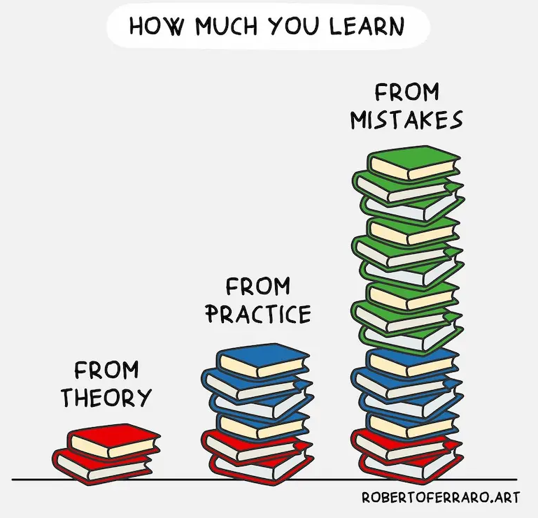

学习就是学会 未知的东西，有些东西简单，要学习的内容少，就一学就会，有些东西庞杂，内容繁多，就要注意学习方法。

<!--more-->

## 书本学习，分片 或 分段学习

对于复杂繁琐的内容，要进行 分段学习 各个知识点，最后把各个知识点按 大纲串联起来就是整体内容。

### 学习流程

0. 设定学习目标 
1. 对学习目标分段，先看分段的大纲，串联起来看看能不能看懂，对于不懂的段落，可以进入学习

### 好处

1. 可以保持精力，并掌握学习成果

## 探索学习或研究

对于没有现成书本讲解的学习内容，收获最多的学习途径就是实际操作，研究并思考。

书本知识只是基础，实践应用可以学到更多，如果实践发生错误，那就是最好的学习机会。

就是在犯错中学习，有目标的学习。