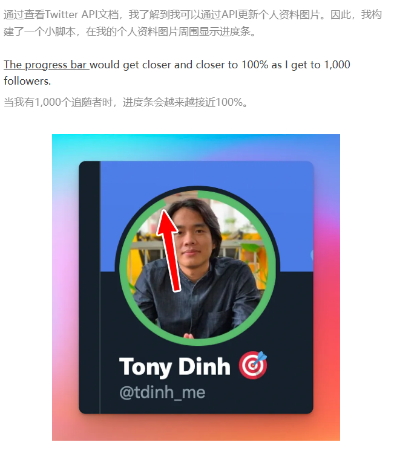

> 怎么为自己工作？自己能为自己做什么？

1. 通过自己为他人服务，不通过公司。
2. 创建小项目，付费订阅。

## 流量 可以通过 Hacker News ,Product Hunt , Twitter
> 粉丝流量

twitter 写软文:

For example, this experiment is my first ever “viral” tweet with 100+ likes:
例如，这个实验是我有史以来第一个“病毒式”的推文，有100多个喜欢：

In summary, my Twitter strategy was:
总而言之，我的Twitter策略是：

Build interesting stuff and share it in public
创建有趣的东西并在公共场合分享

Engage with other people 与他人交往

Write threads 写线程

A lot of memes and jokes
很多的模因和笑话

Overall, be an interesting person and be nice
总的来说，做一个有趣的人，

另一个项目：

TODO: 自己可以看下 ，微信，抖音 API 接口，也可以写个

I added many other features to Black Magic, mostly Twitter tools that help users create more engagements.
我为Black Magic添加了许多其他功能，主要是帮助用户创建更多互动的Twitter工具。

By building and tweeting at the same time, both my MRR (monthly recurring revenue) and my followers were increasing fast.
通过同时建立和发推，我的MRR（每月经常性收入）和我的追随者都在快速增长。

## Quit job 辞职
By August 2021, I have:
到2021年8月，我有：

~$300 MRR from Black Magic
300美元黑魔法

~$200/mo from DevUtils ~$200/月来自DevUtils

~8,000 followers 约8，000名关注者

~1,500 active users (most are free users)
约1，500名活跃用户（大多数是免费用户）

## Travel, Work, and Play 旅行、工作和娱乐
In the first few months after quitting my job, I worked a lot. Probably 12 hours a day, or even 16 hours/day if you also count Twitter as “work”.
在我辞职后的几个月里，我工作了很多。可能每天12个小时，甚至16个小时/天，如果你也把Twitter算作“工作”的话。

## My 3rd product: Xnapper 我的第3个产品：Xnapper
Besides working on my existing products, I experimented and tried new things all the time.
除了在我现有的产品上工作，我一直在实验和尝试新的东西。

I built several small products, some of which failed (EmojiAI, AskCommand).
我开发了几个小产品，其中一些失败了（比如JiajiAI，AskCommand）。

## Typing Mind: my 4th product
Typing Mind：我的第四个产品
OpenAI announced the ChatGPT API on March 1, 2023. I’ve been using ChatGPT via the web interface for a while at that point.
OpenAI于2023年3月1日宣布了ChatGPT API。我已经通过网络界面使用ChatGPT有一段时间了。

The web interface was very limited and I get annoyed by it for a long time. For example, you can’t search your previous chats, the text output was slow, etc. Most annoyingly, the app logged you out and you had to login again every day, which was extremely frustrating.
网络界面非常有限，我很长一段时间都很恼火。例如，你不能搜索你以前的聊天，文本输出很慢，等等。最令人不安的是，应用程序注销了你，你必须每天重新登录，这是非常令人沮丧的。

One of them, Xnapper - a screenshot app, picked up my audience's interest and became my 3rd successful product. It’s now making $6K/month.
其中之一，Xnapper -一个截图应用程序，引起了我的观众的兴趣，成为我的第三个成功的产品。现在是6 K/月。