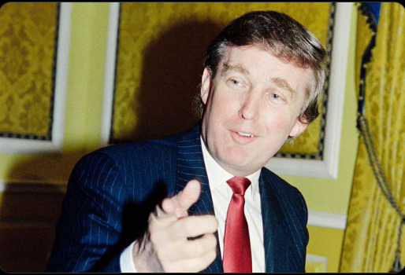
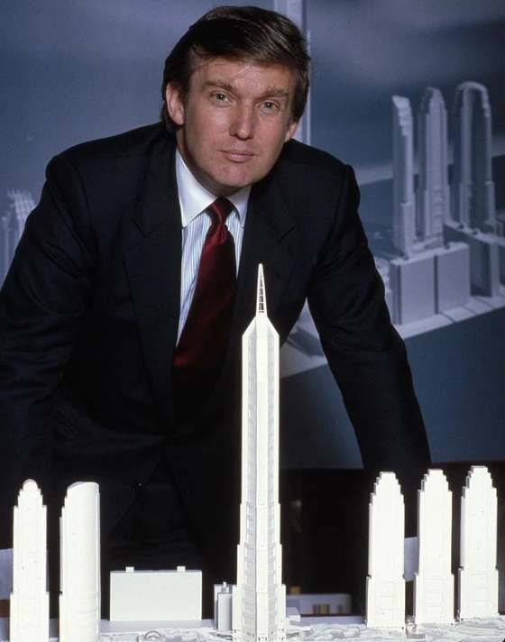

In 1990, Trump was $900M in personal debt. 

1990 年，特朗普的个人债务高达 9 亿美元。

His casinos lost $3M per WEEK. 

他的赌场每周损失300万美元。

Banks seized his yacht, plane, and helicopter.

银行扣押了他的游艇、飞机和直升机。

Then ONE move transformed him into a billionaire TV icon... 

然后一个举动让他成为了亿万富翁的电视偶像......

It started in Manhattan, 1976:

A young developer saw something others missed.

Put your name in giant gold letters on buildings.

Simple. Flashy. Revolutionary.

No one could have predicted what happened next...

它始于1976年的曼哈顿：

一位年轻的开发人员发现了别人没有注意到的东西。

将您的名字用巨大的金色字母刻在建筑物上。

简单。华丽。革命性。

没有人能够预测接下来会发生什么……

The idea caught fire.

Trump Tower became an instant Manhattan icon.

Then Atlantic City casinos made him a gambling king.

By 1988, he bought the Plaza Hotel for $407M.

Success seemed unstoppable...

这个想法立刻引起了轰动。

特朗普大厦立刻成为曼哈顿的标志。

而后大西洋城的赌场使他成为赌王。

到 1988 年，他以 4.07 亿美元收购了广场酒店。

成功似乎不可阻挡……

"Leverage is my friend"

That was Trump's motto. 

Words that would shape his destiny.

His empire grew at a pace Wall Street had never seen:

- $675M Taj Mahal
- $820M Plaza Hotel
- $365M Eastern Shuttle

The seeds of disaster were being planted...

“杠杆是我的朋友”

这是特朗普的座右铭。

这些话语将决定他的命运。

他的帝国以华尔街从未见过的速度扩张：

- 6.75 亿美元的泰姬陵
- 价值 8.2 亿美元的 Plaza Hotel
- 3.65 亿美元东部快运

灾难的种子正在被种下……

Things went from bad to worse:

- Interest rates soared
- Real estate market crashed
- Casino revenues plunged

Then came the meeting that changed everything...

事情变得越来越糟：

- 利率飙升
- 房地产市场崩溃
- 赌场收入大幅下降

然后，一场改变一切的会议来临了……

June 1991:

70 bankers gathered in a Manhattan room.

Trump couldn't make his loan payments.

When he protested, they had a strange response:

1991 年 6 月：

70 名银行家聚集在曼哈顿的一个房间里。

特朗普无法偿还贷款。

当他提出抗议时，他们做出了奇怪的反应：

"Your name is still worth something."

But Trump had noticed something deeper.

Even as his empire crumbled, people still believed in the brand.

The truth was about to transform everything...

“你的名字还是有价值的。”

但特朗普注意到了更深层次的事情。

即使他的帝国崩溃了，人们仍然相信这个品牌。

真相即将改变一切……

The pivot was genius:

Instead of owning buildings, he'd license his name.

- Zero construction costs.
- Pure profit.
- No risk.

But his biggest move was still to come...

这个转变非常巧妙：

他并不拥有建筑物，而是授权使用自己的名字。

- 零建设成本。
- 纯利润。
- 没有风险。

但他最大的举动仍未到来……

2004: Mark Burnett walked into Trump Tower.

"I have an idea for a show..."

Trump demanded $50K per episode.

What happened next shocked everyone...

2004年：马克·伯内特走进特朗普大厦。

“我有一个关于演出的想法……”

特朗普要求每集 5 万美元。

接下来发生的事情让所有人都震惊了……

"The Apprentice" premiered:

28.1M watched the first finale

Trump earned $427K per episode

Ran for 14 seasons

Total earnings: $213M

His catchphrase "You're fired!" became cultural gold.

《学徒》首映：

2810 万观看了第一季大结局

特朗普每集片酬 42.7 万美元

连续 14 个赛季

总收入：2.13亿美元

他的口头禅“你被解雇了！”成为了文化金句。

The transformation was complete:

Name on 50+ buildings worldwide.

Licensing deals in multiple countries.

Products from ties to vodka.

Brand value in BILLIONS.

转换已完成：

全球 50 多座建筑物上的名称。

在多个国家达成许可协议。

产品从领带到伏特加。

品牌价值达数十亿美元。

But Trump's greatest lesson wasn't about real estate...

It was about perception. 

He proved something powerful:

Your brand isn't built through assets.

It's built through storytelling.

但特朗普最大的教训并不是关于房地产的......

这是关于感知的。

他证明了一些强有力的东西：

您的品牌不是通过资产建立起来的。

它是通过讲故事建立起来的。