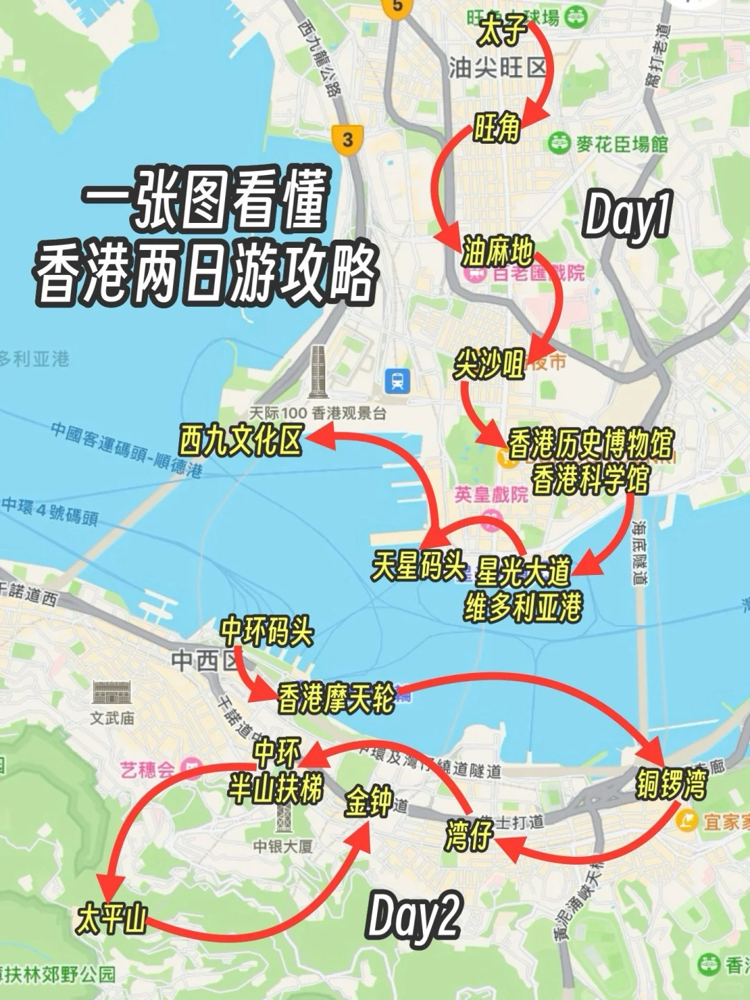
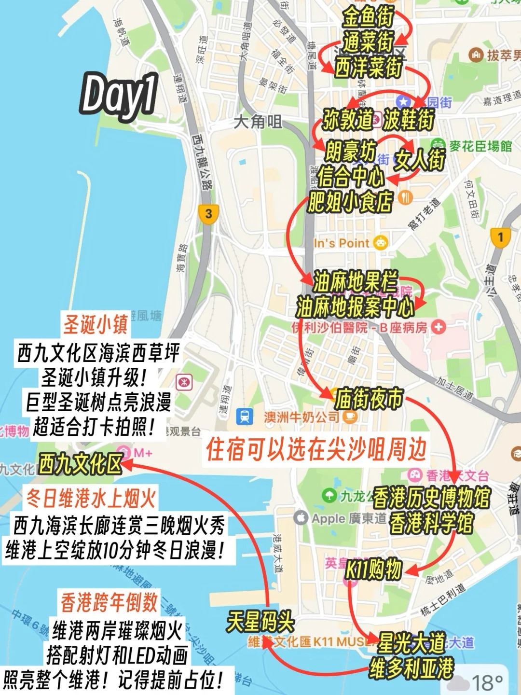
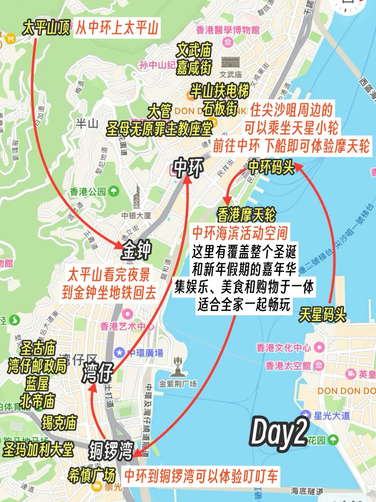
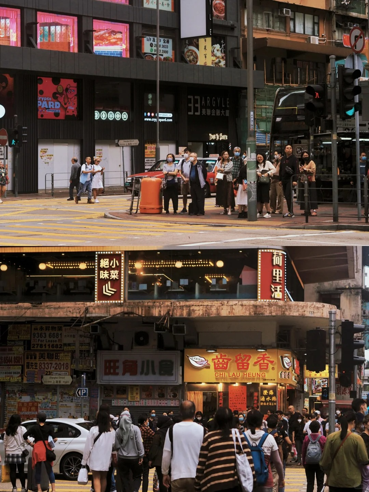
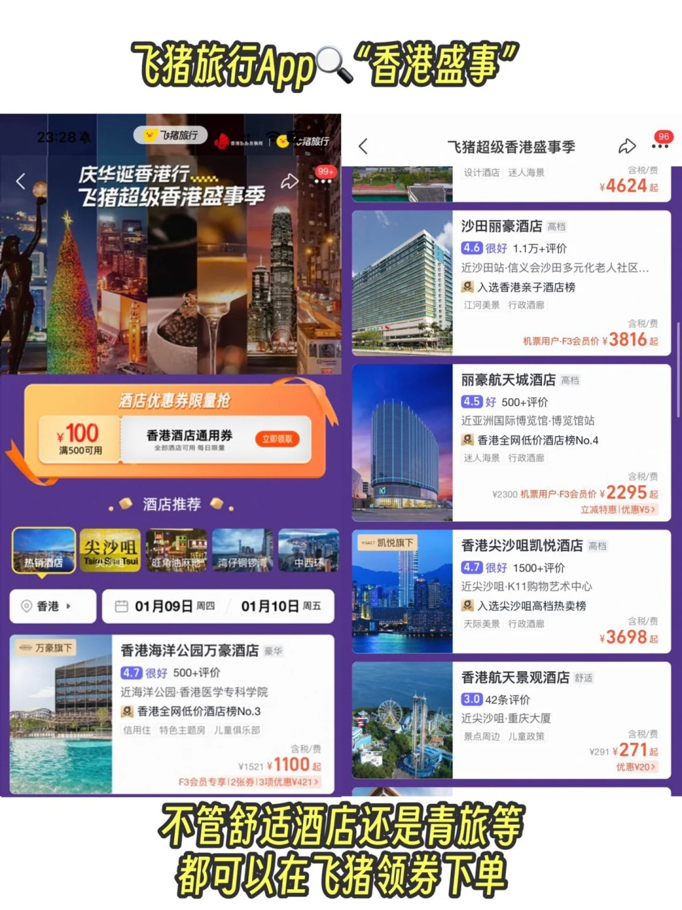
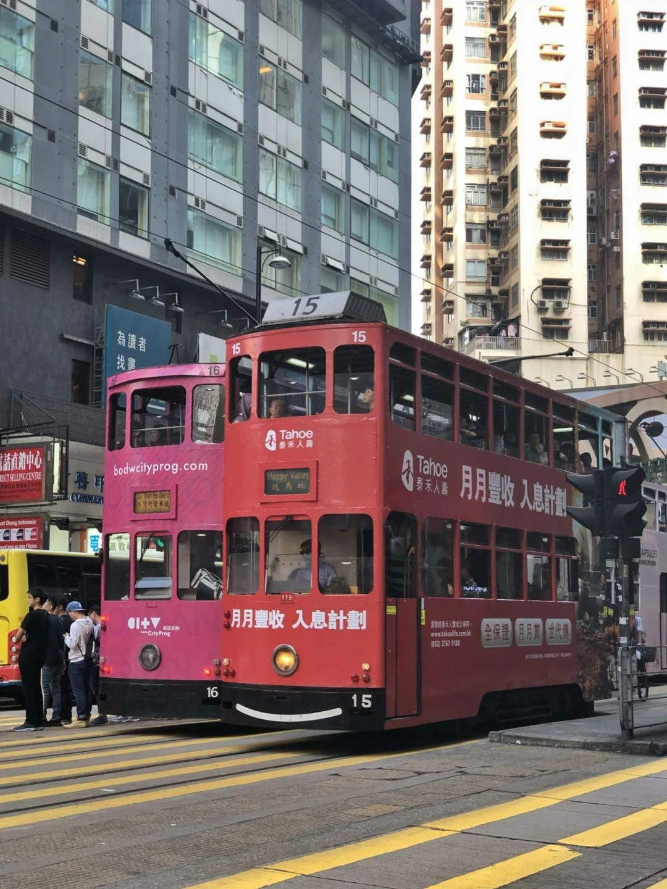
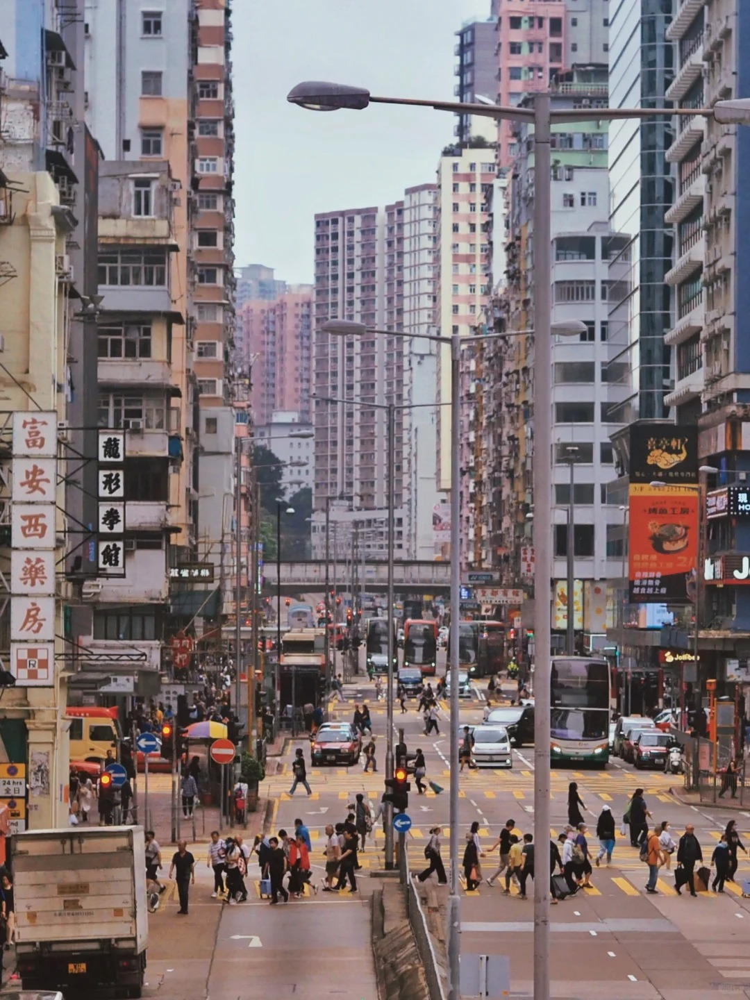
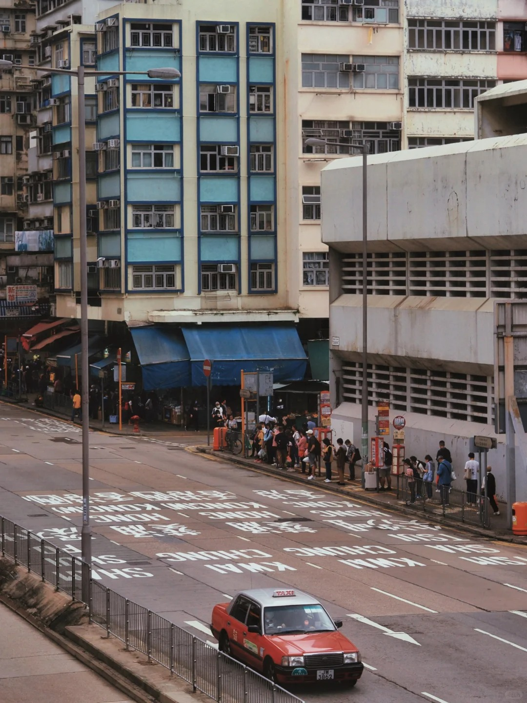
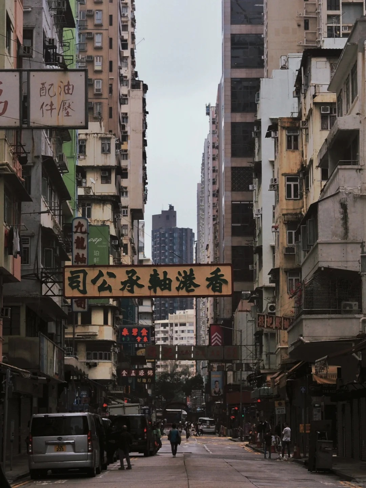

香港游玩

<!--more-->

【两日游行程+打卡活动】
Day❶：太子 → 旺角 → 油麻地 → 尖沙咀 → 星光大道 → 维多利亚港 → 西九文化区
	
🌟推荐亮点：
旺角：打卡金鱼街、波鞋街和女人街，还有网红天桥机位（地铁E2/B3口）。
油麻地：果栏和报案中心港片感十足，是影迷的必去之地（地铁C口）。
星光大道：维港全景+成功人士三件套必拍！如果你在12月24/25/26日期间去维港，一定不能错过的“冬日维港水上烟火“，每晚8点，烟火将西九文化区夜空化作画布，绘出色彩斑斓的图案，相信我真的很浪漫！
西九文化区：边走边玩，别错过西九的圣诞小镇，巨型圣诞树超适合拍照！（即日起至2025年1月1日）。
此外，《The Big Bounce世界巡回香港站》 12月21日至2025年1月5日登陆西九艺术公园，全球最大充气乐园，大人小孩都能玩！约上亲朋好友一起去嗨吧！
	
Day❷：中环码头 → 摩天轮 → 中环海滨活动空间 → 铜锣湾 → 湾仔 → 中环 → 太平山 → 金钟
	
🌟推荐亮点：
中环摩天轮&冬日嘉年华：白天登高俯瞰维港，晚上中环海滨活动空间逛嘉年华，集美食、娱乐和购物于一体，全年龄都能找到乐趣！
（时间：2024年12月20日至2025年2月16日）
太平山顶：一定留点时间欣赏夜景，俯瞰璀璨维港后再下山，浪漫满分！

