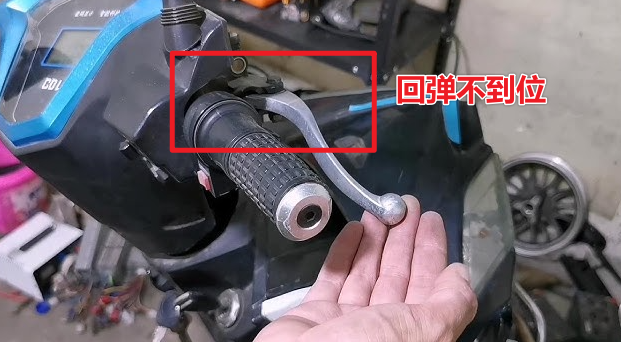
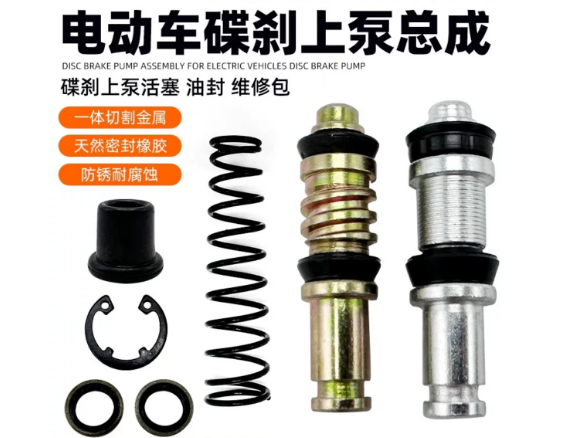
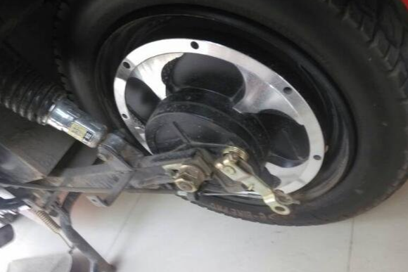
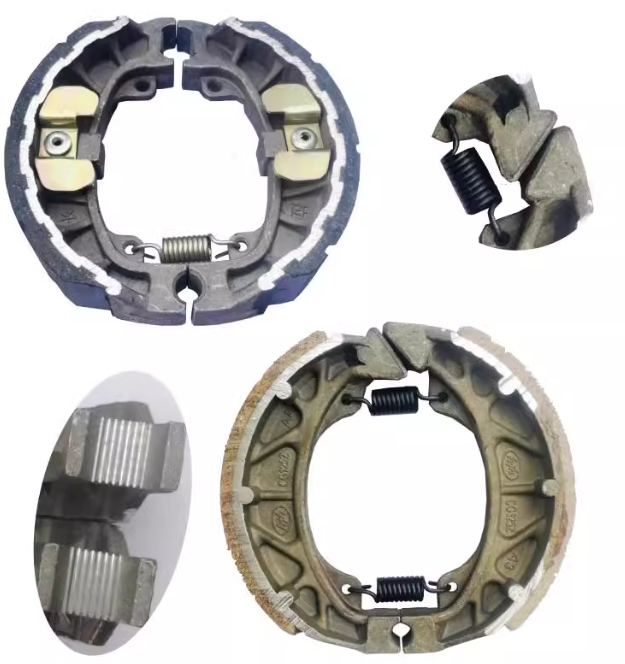

电动车的一些部件是易耗品或容易坏，此时可以进行维修或更换部件。

<!--more-->

## 刹车液压泵弹起障碍

此障碍一般是刹车回弹液压里面有堵塞或者弹簧失去弹性，可以更换套件.
> 量尺寸时要先进行拆卸，注意油脂滴落洒到衣服上。

## 更换鼓刹刹车盘

鼓刹电动车刹车平稳，但容易磨损，一般1年后会失效，是易耗物，可以进行更换。

购买配件不知道尺寸时，可以拍照联系客服，客服会提供准确尺寸。
