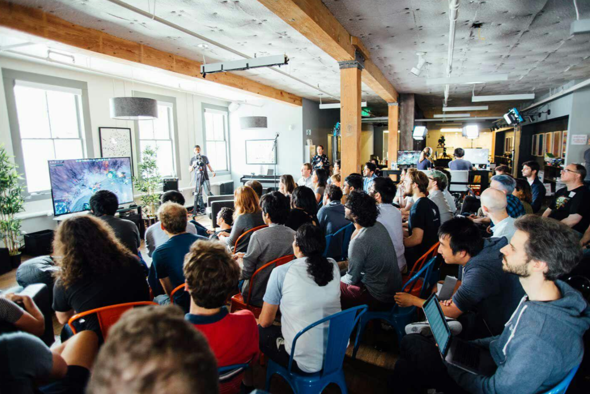

一些特别的资讯
<!--more-->

### [导致失眠的最大问题](https://www.businessinsider.com/sleep-loss-deprivation-america-reasons-health-inequality-economic-stress-money-2024-5)

压力导致睡眠问题，尤其是经济压力

### [提高智能手机的安全](https://s3.documentcloud.org/documents/21018353/nsa-mobile-device-best-practices.pdf) 

1. 不使用时，禁用蓝牙，WiFi和位置服务
2. 每周定期重启
3. 不连接公共网络

> 最终还是网络问题

### [谁是推特上假新闻传播的主力军？](https://arstechnica.com/science/2024/05/key-misinformation-superspreaders-on-twitter-older-women/)

这篇文章分析指出，推特上假新闻传播的主力军（>60%）是年长的女性，她们的账号虽然只占0.3%，却传播了80%的假新闻。

### [Windows 11 的 ReCall 功能](https://github.com/xaitax/TotalRecall)

这个工具可以把浏览历史截图 转为文本，然后我们可以用Windows上的AI助手进行对话。但注意风险

### [用 SQL 的 where 语句查询本地文件](https://github.com/laktak/zfind)

zfind 软件可以使用 sql 中的 where 查询语句进行文件查询，更加可读

如: zfind -w "size>1000MB"

### [友好语气转化器](https://goblin.tools/Formalizer)

对直男或讲话直的人有好处啦，可以增强或减弱语气的强度，赶快收藏吧！

### 《技术封建主义》（Techno Feudalism）

这本书的观点是： 互联网高科技的时代，大企业利用技术，控制着人们的生活，就像中世纪的欧洲一样，大地主占有土地，控制着土地上的一切，农名也成为了地主的私人财产（即农奴）.

作者瓦鲁法基斯建议，政府必须实行一些强制措施.
1. 征收云税，降低地租
2. 推行统一的数字身份
3. 推行数据共享，避免垄断。

### [远紫外线灯](https://www.vox.com/the-highlight/23972651/ultraviolet-disinfection-germicide-far-uv)

紫外线可以消毒、杀菌，但会人体皮肤有害

远紫外线可以做到，但要注意通风，因为会产生臭氧

###  [DNA 数据存储技术](https://kilobaser.com/post/dna-data-storage)
这个 DNA 就是我们身体细胞里的那个 DNA，我们都知道 DNA 只用了 4 个字母就能表示几万个蛋白质编码数据，而且 DNA 的尺寸非常小，我们为何不把数据存在 DNA 上呢？

据估算，1 克干燥的 DNA 可以存储 455 EB 的数据 （1 EB = 1024 PB ）

### [在线速写板](https://www.suxieban.com/index.html#)

### [screenshot-to-code](https://github.com/abi/screenshot-to-code)

截图转代码工具，需要 GPT-4 API key，也可以直接使用 GPT-4啊

###  OpenAI 的总部
OpenAI总部是由3层食品厂改建的很不起眼，里面有2层图书馆，可作为工位,还有科学家的相册

### 纸板难民床，由一家创业公司制造，价格便宜，并且容易使用

### windows11中的画板应用程序引入了AI，只要画轮廓就能生成画面 (无版权)

### 通过 AI 为web开发者调试网页错误

    谷歌为 Chrome 开发者工具引入了AI

### 空气合成蛋白质，用来消除饥荒

一家芬兰的公司宣布，已经实现了空气合成蛋白质。

他们使用一种微生物+二氧化碳，产生一种黄色的蛋白质粉末，过程类似于酿酒，据说营养丰富。

这种蛋白质用来制作巧克力，可以食用。这家公司没有披露成本，但称他们的工厂年产量160吨，相当于 300头牛的蛋白质。

### 生活中最大的快乐来自给予 (慈善)

因此，某企业家在麻省理工学院的演讲过程中，给每个毕业的学生一个信封，里面装有 1000美元。

但要求每人只能拿500美元，剩下的500美元必须送给你认为有需要的人。

### [网站防护软件：雷池](https://github.com/chaitin/SafeLine)

做过网站的同学知道，每天的 恶意请求成千上万，就想找到你的漏洞.

雷池这个防护项目，可以架设在网站前面，过滤所有请求。

### [一款在线图片美化工具 ，可以设置图片背景](https://socialscreenshots.com/editor)

