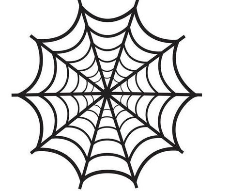

web: 就是 利用 数字信号，网线 进行  文档信息节点间的传输。

<!--more-->

## 细节 （比较拗口）

## B/S 的传输方式

用户在浏览器地址栏输入 URL（统一资源定位符），浏览器通过 HTTP 协议向对应的 Web 服务器发送请求。
服务器接收到请求后，根据请求处理逻辑（如获取网页内容或资源文件），生成 HTTP 响应并发送给浏览器。
浏览器接收到响应后，解析 HTML、CSS 和 JavaScript，并渲染出用户可视化的 Web 页面，用户可以与页面进行交互。
这些组成部分相互配合，构成了现代 Web 的基本工作原理和用户体验。

## C/S 的传输方式

## 服务器分类

- 文件服务器
- 数据库服务器
- 邮件服务器
- Web 服务器等

