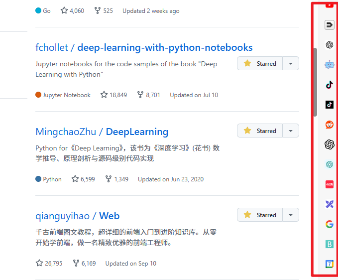
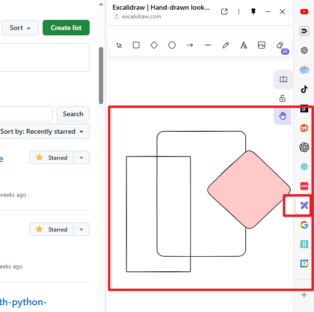
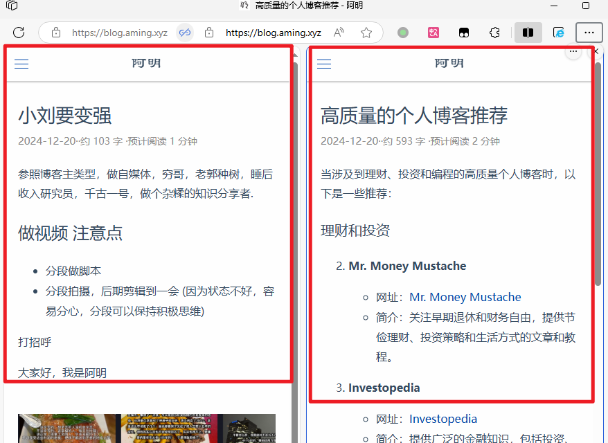
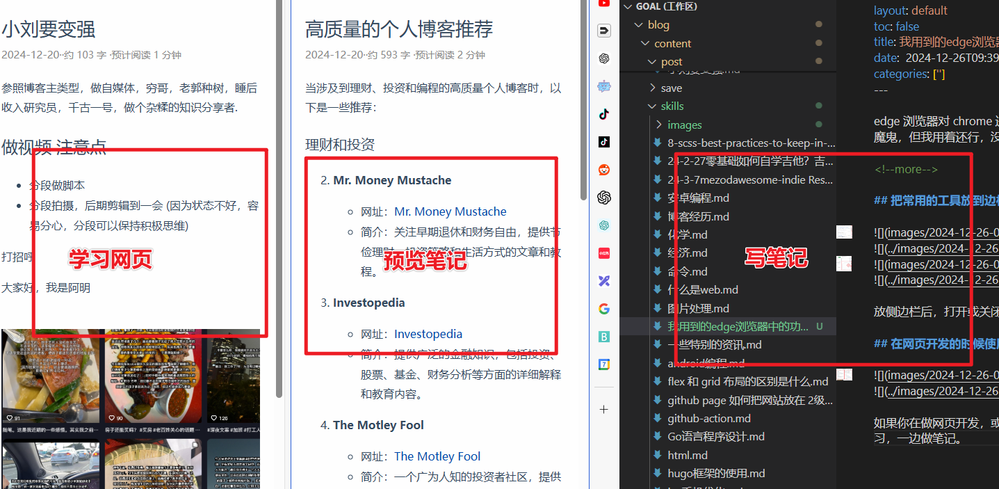
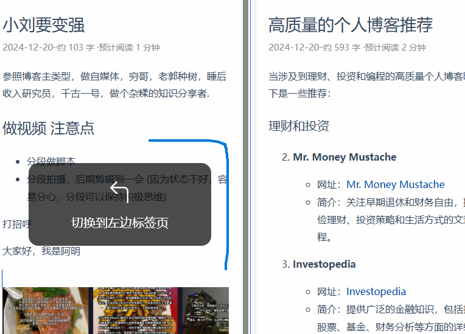
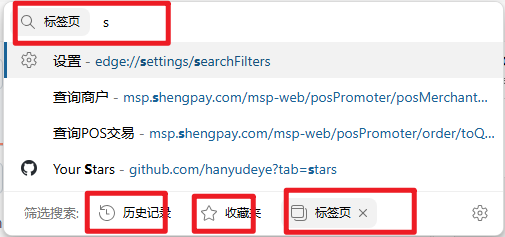
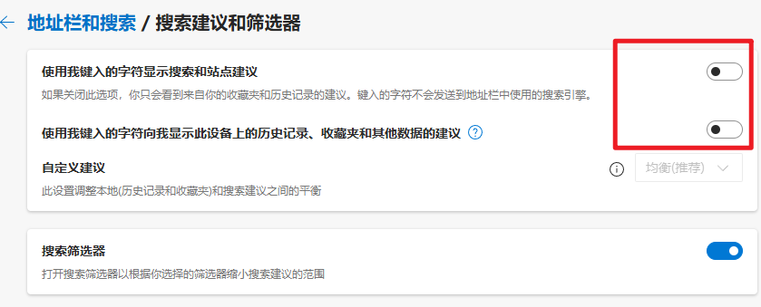

edge 浏览器对 chrome 进行了扩展，我觉得挺好用的，虽然有人说是性能魔鬼，但我用着还行，没有关注到。 

<!--more-->

## 把常用的工具放到边栏

放侧边栏后，打开或关闭常用工具很方便。

## 在网页开发的时候使用分屏功能

如果你在做网页开发，或者通过网页学习新内容，分屏功能很容易一边学习，一边做笔记。

## 使用鼠标手势或 安装vim 键盘插件

## 通过关键词定位某个标签

因为我用浏览器会打开很多标签，定位到某个标签很困难，因为标签标题会给压缩很短很难分辨，所以要经常关闭不用的便签，但还是不方便。 

在地址栏中，输入标签关键词，可以多按几次tab 导航到标签搜索，但操作步骤有点多。

关闭搜索建议选项，可以少按几下 tab 键.

## 继续学习

还有分组功能和 工作区功能待深入学习