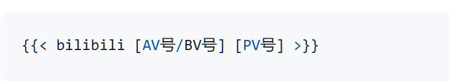

Hugo 是目前最受欢迎的静态网站生成器之一，她能够快速构建含有某种主题的博客、个人网站、文档站点或企业网站，她内置支持 Markdown文件类型的文章。

<!--more-->


### **如何使用 Hugo 创建个人博客**

下面我将为大家演示如何使用 Hugo 快速搭建一个个人博客。

#### **步骤 1：安装 Hugo**

首先，你需要在你的电脑上安装 Hugo。Hugo 支持多种操作系统，包括 Windows、macOS 和 Linux。你可以根据操作系统的不同，选择合适的安装方式。

**在 macOS 上使用 Homebrew 安装 Hugo**：

```bash
brew install hugo
```

**在 Windows 上使用 Scoop 安装 Hugo**：

```powershell
scoop install hugo
```

**在 Linux 上使用 apt 安装 Hugo**：

```bash
sudo apt install hugo
```

#### **步骤 2：创建新站点**

安装好 Hugo 后，打开终端（Terminal），使用以下命令创建一个新的 Hugo 站点：

```bash
hugo new site myblog
```

此命令会在当前目录下创建一个名为 `myblog` 的新文件夹，里面包含了 Hugo 的基础结构。

#### **步骤 3：选择主题并安装**

Hugo 有一个主题库，你可以选择一个喜欢的主题来快速美化你的博客。在 Hugo 官方网站或 GitHub 上，你可以找到成千上万的主题。

例如，使用以下命令来克隆一个主题：

```bash
cd myblog
git init
git submodule add https://github.com/budparr/gohugo-theme-ananke.git themes/ananke
```

然后，你需要在 `config.toml` 文件中指定你所使用的主题：

```toml
theme = "ananke"
```

#### **步骤 4：创建文章**

你可以使用 Hugo 提供的命令来创建新文章：

```bash
hugo new posts/my-first-post.md
```

这会在 `content/posts/` 目录下创建一个 Markdown 文件，你可以在其中编写文章内容。

#### **步骤 5：启动开发服务器**

在本地开发过程中，你可以使用以下命令启动 Hugo 的开发服务器：

```bash
hugo server
# 或指定端口
hugo server -p 1313
```

通过浏览器访问 `http://localhost:1313`，你可以预览你的博客，并查看内容的更新效果。

#### **步骤 6：发布博客**

当你准备好将博客发布到网上时，你可以将其构建为静态文件，使用以下命令：

```bash
hugo
```

此时，Hugo 会将网站的所有静态文件生成到 `public/` 文件夹中，你可以将这些文件上传到任何静态网站托管平台，比如 GitHub Pages、Netlify 或 Vercel。

### **结束语**

如果你是一名自媒体创作者，想要拥有一个快速且现代化的博客平台，Hugo 无疑是一个值得考虑的工具。你可以通过 Hugo 快速发布你的内容，专注于创作，而不必担心服务器、数据库等技术问题。

## 优化

### 插入bilibili视频

在想插入 B 站视频的地方使用 Shortcodes:




(AV 号不带 av/AV，BV 号必须带 bv/BV，PV 号控制分 P，默认为 1)
比如  或者 

### 隐藏文章
``` 
draft: false
hiddenFromHomePage: true
author: '<a href="https://halu.lu" target="_blank">Halulu</a>'
```